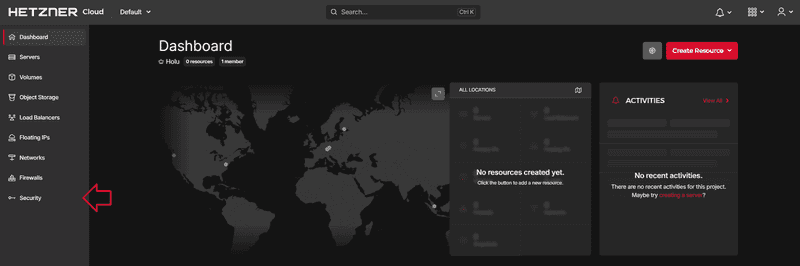
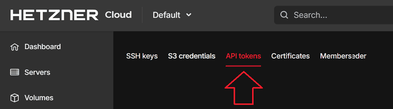
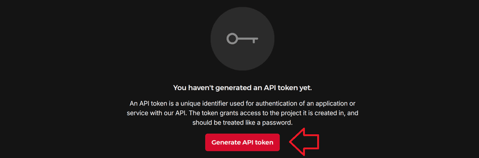
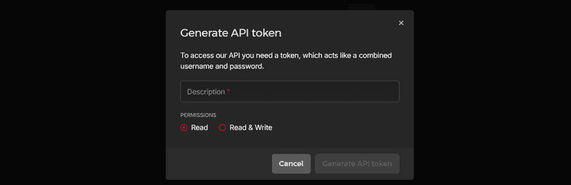

Connect Hetzner Cloud
=====================

Generating an API token
-----------------------

To generate an API token on your `Cloud
Console <https://console.hetzner.cloud/>`__, please open your project
and do the following:

1. Go to **Security** on the left menu bar

   security

2. Go to **API tokens** on the upper menu bar

   API token menu

3. Select **Generate API token**

   generate API token

4. Create your API token

   generate API token

- Enter a description in the upper text box.

- Choose a permission. You can choose between **Read** and **Read &
  Write**.

  If you select **Read**, the token will only be allowed to perform GET
  requests.

  If you select **Read & Write**, the token will be allowed to perform
  GET, DELETE, PUT and POST requests.

5. Copy your API token

   copy API token

You now have an API token. Note that it is not possible to view the
token again once the window has been closed.

**Please note:** Your secret API token has to be included in **every
request** you send to the API.

Example `curl <https://curl.se/>`__:

::

   curl \
       -H "Authorization: Bearer $API_TOKEN" \
       ...
